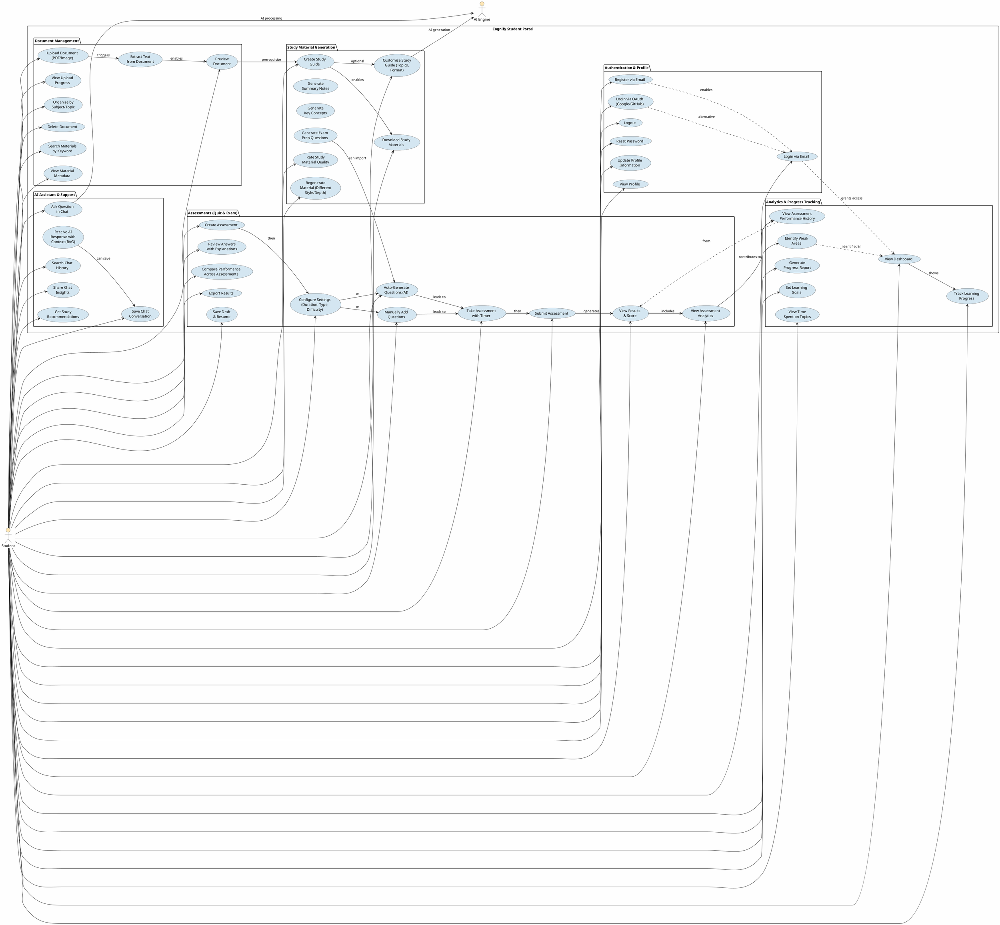

# Cognify - Student Use Cases (Detailed)

## Overview

This document provides detailed use cases for student interactions with the Cognify platform. Students are the primary users who leverage AI-powered tools to enhance their learning experience.

### Key Distinctions:
- **Study Material Generation**: Creating reference materials (guides, summaries, concepts) - static content
- **Assessments**: Interactive self-testing with immediate feedback (quizzes, practice exams, formal exams)
- **Support & Analytics**: AI-powered guidance and performance tracking

---

## Student Use Case Diagram



---

## Detailed Use Cases

### **AUTHENTICATION & PROFILE MANAGEMENT**

#### UC-Auth-1: Register via Email
- **Actor**: Student (Guest)
- **Preconditions**: User is not logged in
- **Main Flow**:
  1. Student navigates to registration page
  2. Enters email, password, full name
  3. System validates email format and password strength
  4. System hashes password (bcrypt)
  5. Creates user record in database
  6. Sends verification email
  7. Student verifies email
  8. Account activated
- **Postconditions**: User account created, can login
- **Alternate Flow**: Email already exists → error message

#### UC-Auth-2: Login via Email
- **Actor**: Student (Registered)
- **Preconditions**: User has registered account
- **Main Flow**:
  1. Student enters email and password
  2. System validates credentials against database
  3. System generates JWT token (valid for 24 hours)
  4. Token sent to client
  5. Student redirected to dashboard
- **Postconditions**: Student authenticated, JWT token stored in browser
- **Security**: Rate-limited, bcrypt password verification

#### UC-Auth-3: Login via OAuth (Google/GitHub)
- **Actor**: Student, OAuth Provider (Google/GitHub)
- **Preconditions**: OAuth credentials configured
- **Main Flow**:
  1. Student clicks "Login with Google/GitHub"
  2. Redirects to provider's login page
  3. Student authorizes Cognify
  4. Provider returns authorization code
  5. Backend exchanges code for access token
  6. Backend retrieves user info (email, name)
  7. System creates/updates user record
  8. JWT issued, student logged in
- **Postconditions**: Student authenticated via OAuth

#### UC-Auth-5: Reset Password
- **Actor**: Student
- **Preconditions**: Student forgot password
- **Main Flow**:
  1. Student clicks "Forgot Password"
  2. Enters email address
  3. System generates reset token (temporary, 1 hour expiry)
  4. Sends reset link via email
  5. Student clicks link
  6. Enters new password
  7. System validates and updates password
  8. System invalidates old tokens
- **Postconditions**: Password updated, student can login with new password

#### UC-Auth-6: Update Profile Information
- **Actor**: Student
- **Preconditions**: Student authenticated
- **Main Flow**:
  1. Student navigates to profile settings
  2. Views current information (name, email, profile picture, bio, interests)
  3. Edits desired fields
  4. System validates input
  5. Updates database record
  6. Shows success message
- **Postconditions**: Profile updated

---

### **DOCUMENT MANAGEMENT**

#### UC-Doc-1: Upload Document (PDF/Image)
- **Actor**: Student
- **Preconditions**: Student authenticated, has storage quota available
- **Main Flow**:
  1. Student navigates to "Upload Materials"
  2. Selects file(s) from computer (PDF, PNG, JPG, JPEG)
  3. System validates file format and size (max 50MB)
  4. Displays upload progress
  5. File transmitted to backend
  6. Backend stores file in `/data/uploads/` with unique name
  7. Triggers backend-engine communication for processing
  8. System returns file metadata (ID, upload time, size)
- **Postconditions**: File stored, queued for processing
- **Alternate Flow**: File too large → error message, user can compress
- **Background Process**: Engine extracts text (OCR) and generates embeddings

#### UC-Doc-2: View Upload Progress
- **Actor**: Student
- **Preconditions**: Student uploading file
- **Main Flow**:
  1. Progress bar shows upload percentage
  2. Real-time updates via WebSocket or polling
  3. Shows estimated time remaining
  4. Student can cancel if needed
- **Postconditions**: Student sees upload status

#### UC-Doc-3: Extract Text from Document
- **Actor**: AI Engine (Background)
- **Preconditions**: Document uploaded
- **Main Flow**:
  1. Engine receives document processing task (Celery job)
  2. Performs OCR (Tesseract/EasyOCR) for images
  3. Extracts text from PDFs
  4. Cleans and normalizes text
  5. Splits into chunks (512 tokens per chunk)
  6. Stores text chunks in database
- **Postconditions**: Text extracted, indexed, ready for embedding

#### UC-Doc-4: Preview Document
- **Actor**: Student
- **Preconditions**: Document uploaded and processed
- **Main Flow**:
  1. Student clicks on material thumbnail
  2. System loads document preview
  3. Shows extracted text or PDF viewer
  4. Displays metadata (upload date, size, subject, extracted text length)
  5. Shows processing status
- **Postconditions**: Student can review document content

#### UC-Doc-5: Organize by Subject/Topic
- **Actor**: Student
- **Preconditions**: Documents uploaded
- **Main Flow**:
  1. Student navigates to materials library
  2. Can assign subject/topic tags to documents
  3. Creates subject categories (e.g., "Math", "Biology", "Chapter 5")
  4. Filters materials by subject
  5. Can move documents between subjects
  6. Views hierarchical organization
- **Postconditions**: Materials organized for easy retrieval

#### UC-Doc-7: Search Materials by Keyword
- **Actor**: Student
- **Preconditions**: Materials uploaded
- **Main Flow**:
  1. Student enters search query in search box
  2. System searches material titles, subjects, and extracted text
  3. Returns matching results ranked by relevance
  4. Displays result snippets
  5. Student clicks to view full material
- **Postconditions**: Relevant materials displayed

---

### **STUDY MATERIAL GENERATION**

#### UC-Study-1: Create Study Guide
- **Actor**: Student, AI Engine
- **Preconditions**: Document uploaded and processed
- **Main Flow**:
  1. Student navigates to material and clicks "Generate Study Guide"
  2. System retrieves text chunks and embeddings
  3. Sends request to engine with content and topic
  4. Engine:
     - Uses semantic search (embeddings) to identify key topics
     - Retrieves most relevant chunks (RAG)
     - Prompts LLM to generate comprehensive study guide
     - Structures output (sections, bullet points, key terms)
  5. Returns generated guide to student
  6. Student can view, download, or regenerate
- **Postconditions**: Study guide created and stored
- **Processing Time**: 30-60 seconds depending on document size

#### UC-Study-2: Customize Study Guide
- **Actor**: Student
- **Preconditions**: Generating or viewing study guide
- **Main Flow**:
  1. Student can customize:
     - **Topics**: Select which topics to focus on
     - **Difficulty Level**: Beginner, Intermediate, Advanced
     - **Format**: Outline, narrative, bullet points
     - **Length**: Concise, moderate, comprehensive
     - **Focus Area**: Theory, examples, practice
  2. System regenerates guide with selected preferences
  3. Student receives customized version
- **Postconditions**: Customized study guide generated

#### UC-Study-3: Generate Summary Notes
- **Actor**: Student, AI Engine
- **Preconditions**: Document uploaded
- **Main Flow**:
  1. Student selects "Generate Summary"
  2. Engine processes document for key points
  3. Creates condensed summary (20-30% of original length)
  4. Highlights important concepts
  5. Returns as downloadable note
- **Postconditions**: Summary notes created

#### UC-Study-4: Generate Key Concepts
- **Actor**: Student, AI Engine
- **Preconditions**: Document uploaded
- **Main Flow**:
  1. Student selects "Extract Key Concepts"
  2. Engine identifies critical terms and definitions
  3. Creates concept dictionary/glossary
  4. Organizes by topic
  5. Can export as flashcard deck
- **Postconditions**: Key concepts identified and organized

#### UC-Study-5: Generate Exam Prep Questions
- **Actor**: Student, AI Engine
- **Preconditions**: Document uploaded
- **Main Flow**:
  1. Student selects "Generate Exam Questions"
  2. Specifies number of questions and difficulty
  3. Engine generates diverse question types:
     - Multiple choice
     - Short answer
     - Essay
     - True/False
  4. Questions based on document content
  5. Includes answers with explanations
- **Postconditions**: Exam prep questions ready

#### UC-Study-6: Download Study Materials
- **Actor**: Student
- **Preconditions**: Study material generated
- **Main Flow**:
  1. Student clicks "Download"
  2. Selects format (PDF, Word, Markdown)
  3. System generates formatted document
  4. File sent to student
  5. Browser downloads file
- **Postconditions**: Material downloaded locally

#### UC-Study-7: Rate Study Material Quality
- **Actor**: Student
- **Preconditions**: Study material viewed
- **Main Flow**:
  1. Student rates material (1-5 stars)
  2. Optionally leaves feedback/comment
  3. System stores rating in database
  4. Ratings help improve future generation
- **Postconditions**: Rating recorded, helps train recommendation system

#### UC-Study-8: Regenerate Material (Different Style/Depth)
- **Actor**: Student, AI Engine
- **Preconditions**: Material already generated
- **Main Flow**:
  1. Student clicks "Regenerate"
  2. Selects different parameters (style, depth, focus)
  3. Engine generates alternative version
  4. Can compare with previous version
  5. Keeps best version or saves multiple versions
- **Postconditions**: New version generated

---

### **ASSESSMENTS (QUIZ & EXAM CONSOLIDATED)**

#### UC-Assess-1: Create Assessment
- **Actor**: Student
- **Preconditions**: Materials uploaded
- **Main Flow**:
  1. Student navigates to "Assessments"
  2. Clicks "Create Assessment"
  3. Enters details:
     - Assessment name
     - Type: "Self-Practice Quiz" or "Formal Exam"
     - Subject/topics
     - Associated materials
  4. System creates assessment record
  5. Proceeds to configuration
- **Postconditions**: Assessment created, ready to configure

#### UC-Assess-2: Configure Settings (Duration, Type, Difficulty)
- **Actor**: Student
- **Preconditions**: Assessment created
- **Main Flow**:
  1. Student configures:
     - **Duration**: Quiz (no limit or 5-60 min), Exam (1-4 hours)
     - **Number of Questions**: 5-100
     - **Question Types**: Multiple choice, short answer, true/false, essay (can mix)
     - **Difficulty**: Easy, Medium, Hard (or mixed)
     - **Randomization**: Randomize questions/options (yes/no)
     - **Passing Score**: Required % to pass (default 60%)
     - **Time Limit Per Question**: Optional
     - **Show Answers**: Immediately, after completion, never
     - **Allow Retakes**: Yes/No, limit number
     - **Question Visibility**: Show/hide point values
  2. Settings saved
- **Postconditions**: Assessment configured per preferences

#### UC-Assess-3: Auto-Generate Questions (AI)
- **Actor**: Student, AI Engine
- **Preconditions**: Assessment configured
- **Main Flow**:
  1. Student clicks "Auto-Generate Questions"
  2. Specifies:
     - Number of questions (5-100)
     - Question type distribution
     - Difficulty distribution
     - Topics to focus on (or auto-select from material)
  3. Engine:
     - Retrieves relevant content chunks using embeddings
     - Generates diverse questions based on content
     - Creates answer key with explanations
     - Validates question quality
  4. Questions added to assessment
- **Postconditions**: Questions generated and ready
- **Processing Time**: 30-120 seconds depending on question count

#### UC-Assess-4: Manually Add Questions
- **Actor**: Student
- **Preconditions**: Assessment configured
- **Main Flow**:
  1. Student can:
     - **Type new questions**: Add single question at a time
     - **Import questions**: From previous assessments/quiz bank
     - **Paste questions**: Bulk import from document
  2. For each question, specify:
     - Question text
     - Question type
     - Answer options (for MCQ)
     - Correct answer(s)
     - Explanation
     - Points value
     - Difficulty level
     - Topic/tag
  3. Validation checks
  4. Questions stored
- **Postconditions**: Custom questions added

#### UC-Assess-5: Take Assessment with Timer
- **Actor**: Student
- **Preconditions**: Assessment created and configured
- **Main Flow**:
  1. Student clicks "Start Assessment"
  2. Assessment begins:
     - Timer displays (if set) with countdown
     - Shows current question # and total questions
     - Displays points available
     - Visual progress bar
     - Can flag questions for review
  3. Student answers questions:
     - Select from options (MCQ)
     - Type response (short answer/essay)
     - True/False selection
  4. Can skip and return to questions
  5. Warnings at 10 minutes, 5 minutes remaining
  6. Auto-submit if time expires
- **Postconditions**: Assessment in progress, auto-save enabled

#### UC-Assess-6: Submit Assessment
- **Actor**: Student
- **Preconditions**: Assessment completed or time expired
- **Main Flow**:
  1. Student clicks "Submit"
  2. System shows confirmation dialog (answers locked after submission)
  3. Student confirms
  4. Sends to backend for grading
  5. Engine scores:
     - Auto-grades multiple choice, true/false
     - Flags essays/short answers for potential manual review
     - Calculates total score
     - Identifies incorrect areas
     - Generates detailed analysis
  6. Student sees "Assessment submitted successfully"
- **Postconditions**: Graded, results generated

#### UC-Assess-7: View Results & Score
- **Actor**: Student
- **Preconditions**: Assessment submitted and graded
- **Main Flow**:
  1. Student sees results dashboard:
     - **Total Score**: X/Y points
     - **Percentage**: X%
     - **Status**: Pass/Fail (if graded)
     - **Time Taken**: Duration of assessment
     - **Score by Section**: Points breakdown by topic
  2. Visual indicators (green for pass, red for fail)
  3. Can view detailed breakdown
  4. Can access review page
- **Postconditions**: Results viewed

#### UC-Assess-8: Review Answers with Explanations
- **Actor**: Student
- **Preconditions**: Assessment graded
- **Main Flow**:
  1. Student views review page showing for each question:
     - Question text
     - Student's answer (highlighted)
     - Correct answer
     - Explanation (AI-generated or provided)
     - Points awarded/lost
     - Difficulty indicator
  2. Can filter by:
     - All questions
     - Correct only
     - Incorrect only
     - By topic/type
  3. Navigation between questions
  4. Can mark questions for later study
- **Postconditions**: Student understands performance and mistakes

#### UC-Assess-9: View Assessment Analytics
- **Actor**: Student
- **Preconditions**: Assessment completed
- **Main Flow**:
  1. Student views analytics dashboard:
     - **Score Trend**: Performance across retakes (line graph)
     - **Topic Breakdown**: Correct % per topic (bar chart)
     - **Question Type Performance**: How student did on MCQ vs essay
     - **Time Analysis**: Average time per question
     - **Difficulty Analysis**: Performance by difficulty level
     - **Class Comparison**: How score compares to average (if class-based)
  2. AI-generated insights:
     - "Strong in [topic]: 95%"
     - "Needs work in [topic]: 40%"
     - Specific skill gaps
  3. Personalized recommendations for improvement
- **Postconditions**: Data-driven learning insights available

#### UC-Assess-10: Compare Performance Across Assessments
- **Actor**: Student
- **Preconditions**: Multiple assessments completed
- **Main Flow**:
  1. Student views "Assessment History"
  2. Table showing:
     - Assessment name, type (quiz/exam), date, score, %, time
     - Subject/topics covered
     - Pass/Fail status
  3. Can sort by: date, score, subject, type
  4. Visual comparison:
     - Score trend line graph
     - Topic-wise improvement tracking
     - Identify strongest and weakest areas
  5. Can compare any two assessments side-by-side
- **Postconditions**: Learning progression tracked

#### UC-Assess-11: Export Results
- **Actor**: Student
- **Preconditions**: Assessment completed
- **Main Flow**:
  1. Student clicks "Export"
  2. Selects format: PDF, CSV, Excel, JSON
  3. System generates report including:
     - Assessment name, score, date
     - Question-by-question breakdown
     - Performance analytics
     - Study recommendations
     - Topic-wise analysis
  4. File downloaded
- **Postconditions**: Report exported for personal records

#### UC-Assess-12: Save Draft & Resume
- **Actor**: Student
- **Preconditions**: Assessment in progress
- **Main Flow**:
  1. Student can click "Save & Exit" anytime
  2. Current answers automatically saved
  3. Session stored with:
     - Questions answered
     - Flagged questions
     - Time elapsed
     - Last save timestamp
  4. Student can return later and click "Resume"
  5. Assessment continues from where they left off
  6. Timer resumes if time-based
- **Postconditions**: Draft saved, can be resumed later

---

### **AI ASSISTANT & SUPPORT**

#### UC-Chat-1: Ask Question in Chat
- **Actor**: Student
- **Preconditions**: Student authenticated, in chat interface
- **Main Flow**:
  1. Student types question or clarification request
  2. Can reference specific material or topic
  3. Can attach context (document snippet, quiz question)
  4. Clicks "Send" or presses Enter
  5. Question sent to backend, then to engine
- **Postconditions**: Question transmitted

#### UC-Chat-2: Receive AI Response with Context
- **Actor**: AI Engine
- **Preconditions**: Question received
- **Main Flow**:
  1. Engine processes question:
     - Performs semantic search using embeddings
     - Retrieves most relevant document chunks
     - Loads RAG context
  2. Constructs LLM prompt with:
     - Student's question
     - Retrieved relevant context
     - Learning history (optional)
  3. LLM generates response
  4. Response sent back to student
  5. Displayed in chat with source citations
  6. Shows confidence level or "sources used" link
- **Postconditions**: AI response displayed with context

#### UC-Chat-3: Save Chat Conversation
- **Actor**: Student
- **Preconditions**: Chat conversation ongoing
- **Main Flow**:
  1. Student clicks "Save Conversation"
  2. Conversation saved with:
     - Timestamp
     - Topic/subject
     - All Q&A pairs
     - Referenced materials
  3. Assigned conversation ID
  4. Student can name/tag conversation
  5. Can later retrieve and continue
- **Postconditions**: Conversation archived for reference

#### UC-Chat-4: Search Chat History
- **Actor**: Student
- **Preconditions**: Multiple chat sessions completed
- **Main Flow**:
  1. Student accesses chat history
  2. Can search by:
     - Keywords in questions/answers
     - Date range
     - Topic/subject
     - Specific materials referenced
  3. Results displayed chronologically or by relevance
  4. Can reopen and continue chat
- **Postconditions**: Previous chats retrieved

#### UC-Chat-6: Get Study Recommendations
- **Actor**: Student, AI Engine
- **Preconditions**: Student has quiz/exam history
- **Main Flow**:
  1. Engine analyzes student performance data:
     - Weak topics from quizzes/exams
     - Time spent per topic
     - Frequent mistakes
     - Learning velocity
  2. Generates AI-driven recommendations:
     - "You're struggling with Calculus integration—try generating a focused study guide"
     - "You've improved 15% in Chemistry—keep up the momentum"
     - "Consider practicing more timed exams to improve speed"
  3. Student sees recommendations in chat or dashboard
  4. Can click to act on recommendations
- **Postconditions**: Personalized study guidance provided

---

### **ANALYTICS & PROGRESS TRACKING**

#### UC-Analytics-1: View Dashboard
- **Actor**: Student
- **Preconditions**: Student authenticated
- **Main Flow**:
  1. Student lands on dashboard home page
  2. Dashboard displays:
     - **Quick Stats**: Total materials, quizzes taken, exams completed
     - **Recent Activity**: Last actions (upload, quiz, exam)
     - **Current Goals**: Progress toward learning objectives
     - **Upcoming**: Scheduled exams or study sessions
     - **Recommendations**: AI suggestions
     - **Performance Summary**: Recent quiz/exam scores
  3. Fully customizable widget layout
- **Postconditions**: Student sees learning overview

#### UC-Analytics-2: Track Learning Progress
- **Actor**: Student
- **Preconditions**: Multiple quizzes/exams completed
- **Main Flow**:
  1. Student views progress page
  2. Sees visual timeline:
     - Quiz scores over weeks/months
     - Trend line showing improvement
     - Topic-by-topic progress
  3. Completion status:
     - % complete per subject
     - Materials reviewed
     - Practice problems solved
  4. Engagement metrics:
     - Study hours per week
     - Materials uploaded
     - Questions asked in chat
- **Postconditions**: Student understands learning trajectory

#### UC-Analytics-3: View Quiz Performance History
- **Actor**: Student
- **Preconditions**: Quizzes completed
- **Main Flow**:
  1. Student views "Quiz History"
  2. Table showing all quizzes:
     - Quiz name, date, score, time taken
     - Material covered
     - Difficulty level
  3. Sortable/filterable by:
     - Date, score, subject, difficulty
  4. Click to view detailed review
  5. Visualizations:
     - Score distribution (histogram)
     - Performance trends (line graph)
     - Topic breakdown (pie chart)
- **Postconditions**: Quiz performance history reviewed

#### UC-Analytics-4: View Exam Performance History
- **Actor**: Student
- **Preconditions**: Exams completed
- **Main Flow**:
  1. Similar to quiz history but for exams
  2. Shows:
     - Exam name, date, score, status (pass/fail)
     - Pass/fail trend
     - Score improvements on retakes
  3. Detailed comparison across exams
  4. Analysis of weak topics
- **Postconditions**: Exam performance reviewed

#### UC-Analytics-5: Identify Weak Areas
- **Actor**: Student
- **Preconditions**: Assessment data collected (quizzes/exams)
- **Main Flow**:
  1. System analyzes performance data:
     - Questions answered incorrectly
     - Topics with lowest scores
     - Most frequent mistake types
  2. Generates "Weak Areas Report":
     - List topics ranked by struggle
     - Percentage correct per topic
     - Comparison to class average (if available)
     - AI diagnosis (e.g., "Conceptual misunderstanding" vs "Careless errors")
  3. Student views report with:
     - Heat map of problem areas
     - Recommended study materials
     - Suggested quiz topics
- **Postconditions**: Weak areas identified with actionable insights

#### UC-Analytics-6: Generate Progress Report
- **Actor**: Student
- **Preconditions**: Learning data available
- **Main Flow**:
  1. Student clicks "Generate Report"
  2. Selects period (week, month, semester)
  3. System compiles:
     - Study time summary
     - Materials processed (count, types)
     - Assessments completed (quizzes, exams)
     - Average scores
     - Weak and strong areas
     - Progress indicators
  4. Report formatted as PDF or document
  5. Can include visualizations (charts, graphs)
  6. Student can download or share
- **Postconditions**: Progress report generated and available

#### UC-Analytics-7: Set Learning Goals
- **Actor**: Student
- **Preconditions**: Dashboard accessible
- **Main Flow**:
  1. Student clicks "Set Goals"
  2. Can set:
     - **Score Goals**: "Achieve 85% on Calc exam"
     - **Study Time Goals**: "Study 10 hours/week"
     - **Material Goals**: "Complete 5 chapters"
     - **Milestone Goals**: "Take 20 practice quizzes"
  3. System displays goals on dashboard
  4. Tracks progress toward goals
  5. Sends reminders/notifications for motivation
  6. Shows achievement when goals completed
- **Postconditions**: Goals created and tracked

#### UC-Analytics-8: View Time Spent on Topics
- **Actor**: Student
- **Preconditions**: Study activity recorded
- **Main Flow**:
  1. Student accesses "Time Analysis"
  2. Sees breakdown:
     - Time per subject/topic (pie chart)
     - Study sessions (calendar view)
     - Average session duration
     - Most/least studied topics
  3. Recommendations:
     - "You're spending too little time on Topic X"
     - "You've studied Topic Y efficiently"
  4. Can adjust study schedule accordingly
- **Postconditions**: Time usage analyzed and optimized

---

## Student Use Case Matrix

| Use Case | Category | Frequency | Complexity | AI Required |
|----------|----------|-----------|-----------|------------|
| UC-Auth-2 | Auth | Medium | Low | No |
| UC-Doc-1 | Documents | High | Medium | No |
| UC-Study-1 | Generation | High | High | Yes |
| UC-Assess-1 | Assessment | High | Medium | No |
| UC-Assess-3 | Assessment | High | High | Yes |
| UC-Assess-5 | Assessment | High | Low | No |
| UC-Assess-9 | Assessment | Medium | Medium | Yes |
| UC-Chat-1 | Support | Medium | High | Yes |
| UC-Analytics-1 | Analytics | High | Low | No |
| UC-Analytics-4 | Analytics | Medium | Medium | Yes |

---

## Integration Flow: Complete Student Journey

```
1. REGISTRATION & AUTHENTICATION
   ↓ Student registers/logs in
   ↓ JWT token issued
   ↓ Redirected to dashboard

2. MATERIAL UPLOAD
   ↓ Student uploads document (PDF/image)
   ↓ Backend stores file
   ↓ Engine processes: OCR → text extraction → embeddings
   ↓ Material ready in library

3. STUDY PREPARATION (Static Reference Materials)
   ↓ Student creates study guide (AI generates)
   ↓ OR generates summary notes
   ↓ OR extracts key concepts
   ↓ Student downloads materials
   ↓ Used for reading/reference

4. PRACTICE & SELF-ASSESSMENT (Interactive Testing)
   ↓ Student creates assessment (quiz or exam)
   ↓ Configures settings (duration, difficulty, question count)
   ↓ AI auto-generates questions OR student adds manually
   ↓ Takes assessment with timer
   ↓ Engine scores assessment
   ↓ Student reviews answers with explanations
   ↓ System identifies weak areas & provides feedback

5. CONTINUOUS IMPROVEMENT
   ↓ Student asks questions in AI chat (RAG-powered)
   ↓ Student reviews performance analytics
   ↓ System recommends focus areas
   ↓ Student creates more assessments on weak topics
   ↓ Cycle repeats with improved performance

6. PROGRESS TRACKING
   ↓ Dashboard shows all activity
   ↓ Progress report generated
   ↓ Weak areas identified
   ↓ Goals tracked and updated
```

---

## Student Roles & Permissions

### **Free Student**
- ✅ Upload up to 5 documents/month
- ✅ Generate 3 quizzes/month
- ✅ Limited AI chat sessions (5/month)
- ✅ Basic analytics
- ❌ Cannot create exams
- ❌ No priority support

### **Premium Student**
- ✅ Unlimited document uploads
- ✅ Unlimited quiz/exam creation
- ✅ Unlimited AI chat
- ✅ Advanced analytics & reports
- ✅ Custom learning plans
- ✅ Priority support
- ✅ Export capabilities

### **Class/Group Student**
- ✅ All premium features
- ✅ Class-specific materials library
- ✅ Compare performance with classmates
- ✅ Group study sessions
- ✅ Instructor assignments

---

## Success Criteria for Student Use Cases

1. **Quick Registration**: < 2 minutes
2. **Document Processing**: < 2 minutes for typical document
3. **Material Generation**: 30-90 seconds
4. **Quiz Completion**: 15-45 minutes
5. **Exam Completion**: 1-3 hours
6. **Analytics Loading**: < 3 seconds
7. **AI Response Time**: < 10 seconds (including RAG retrieval)
8. **User Satisfaction**: > 4.5/5 stars on generated materials

