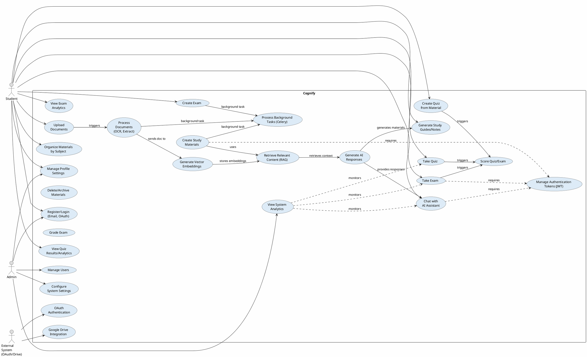

# Cognify - Global Use Case Diagram

## System Overview

Cognify is an AI-powered educational platform that helps students learn more effectively through intelligent document processing, personalized study materials, and interactive learning features.

## Use Case Diagram (PlantUML Format)



## System Components Breakdown

### 1. **Frontend (React + Vite)**
- **Actors**: Student, Admin
- **Responsibilities**: UI/UX, form handling, real-time updates
- **Key Pages**: Dashboard, Material Upload, Quiz Interface, Analytics, Admin Panel

### 2. **Backend (Node.js/Express)**
- **Actors**: Students, Admins, External Systems (OAuth, Google Drive)
- **Responsibilities**: 
  - REST API endpoints
  - User authentication & authorization
  - Metadata management
  - Session handling
  - File access control
- **Key Routes**:
  - `/api/auth` - Authentication & Profile
  - `/api/materials` - Document management
  - `/api/subjects` - Subject organization
  - `/api/quiz` - Quiz management
  - `/api/exams` - Exam management
  - `/api/analytics` - User analytics
  - `/api/chat` - Chat interface
  - `/api/admin` - Admin functions

### 3. **AI Engine (Python/FastAPI)**
- **Responsibilities**: 
  - Document processing (OCR, text extraction)
  - Vector embeddings generation
  - RAG (Retrieval-Augmented Generation) pipeline
  - Quiz generation & scoring
  - AI response generation
- **External Dependencies**:
  - **Ollama**: Local LLM & embedding model
  - **Redis**: Task queue broker for Celery
  - **PostgreSQL + pgvector**: Vector database
  - **Celery**: Background task processing

### 4. **Database (PostgreSQL + pgvector)**
- **Data Models**: Users, Materials, Subjects, Quizzes, Exams, Analytics, Embeddings
- **Features**: Role-based access (Student, Admin), Vector search capabilities

## Key Use Case Flows

### A. Document Processing & Study Material Generation
```
1. Student uploads document
2. Backend validates and stores metadata
3. Engine processes document (extract text via OCR)
4. Engine generates embeddings (vectors)
5. Embeddings stored in pgvector
6. Student can now create quiz/study guides from processed material
```

### B. AI Chat & Knowledge Retrieval
```
1. Student asks question in chat
2. Backend receives query
3. Engine retrieves relevant content (semantic search with embeddings)
4. Engine generates AI response with retrieved context (RAG)
5. Response sent to student
```

### C. Quiz/Exam Workflow
```
1. Student creates quiz from study material
2. System generates questions (background task via Celery)
3. Student takes quiz
4. Engine scores responses
5. Results and analytics generated
6. Student views performance analytics
```

### D. Authentication & Authorization
```
1. Student registers/logs in (JWT-based)
2. Email or OAuth (Google/GitHub)
3. Backend verifies credentials
4. JWT token issued
5. Token required for all subsequent API calls
6. Role-based access control enforced (Student vs Admin)
```

## Key Features by Role

### **Student**
- ✅ Upload documents (PDF, images)
- ✅ Organize materials by subject
- ✅ Generate AI-powered study guides
- ✅ Create & take quizzes
- ✅ Create & take exams
- ✅ Chat with AI assistant
- ✅ View performance analytics
- ✅ Manage profile settings

### **Admin**
- ✅ User account management
- ✅ System-wide analytics
- ✅ Configuration settings
- ✅ Role-based access control
- ✅ System health monitoring

### **External Systems**
- ✅ Google OAuth login
- ✅ GitHub OAuth login
- ✅ Google Drive integration (document upload)

## Technology Stack

| Layer | Technology |
|-------|------------|
| **Frontend** | React, Vite, JavaScript |
| **Backend API** | Node.js, Express.js, Passport.js |
| **Authentication** | JWT, OAuth 2.0 (Google/GitHub), bcrypt |
| **Database** | PostgreSQL, pgvector (vector search) |
| **AI Engine** | Python, FastAPI, Ollama |
| **LLM Models** | qwen2.5:3b (generation), nomic-embed-text (embeddings) |
| **Task Queue** | Celery, Redis |
| **File Storage** | Mounted volumes (Docker), local filesystem |
| **Security** | Helmet.js, CORS, rate limiting, input sanitization |
| **Orchestration** | Docker Compose |

## Data Flow Diagram

```
┌─────────────┐
│   Student   │
└──────┬──────┘
       │
       ▼
┌──────────────────┐      ┌──────────────┐
│  React Frontend  │◄────►│   Express    │
│  (Port 3000)     │      │  Backend     │
└──────┬───────────┘      │  (Port 5000) │
       │                  └──────┬───────┘
       │                         │
       └─────────────┬───────────┘
                     │
        ┌────────────┼────────────┐
        │            │            │
        ▼            ▼            ▼
    ┌──────┐  ┌──────────┐  ┌──────────────┐
    │  JWT │  │PostgreSQL│  │  FastAPI     │
    │ Auth │  │ (Metadata│  │  Engine      │
    └──────┘  │Embeddings)  │ (Port 8000)  │
              └──────────┘  └──────┬───────┘
                                   │
                    ┌──────────────┼──────────────┐
                    │              │              │
                    ▼              ▼              ▼
                  ┌────┐      ┌────────┐     ┌──────┐
                  │    │      │ Celery │     │Ollama│
                  │Redis      │(Tasks) │     │(LLM) │
                  └────┘      └────────┘     └──────┘
```

---

**Last Updated**: May 2, 2026  
**Project**: Cognify - AI-Powered Educational Platform
